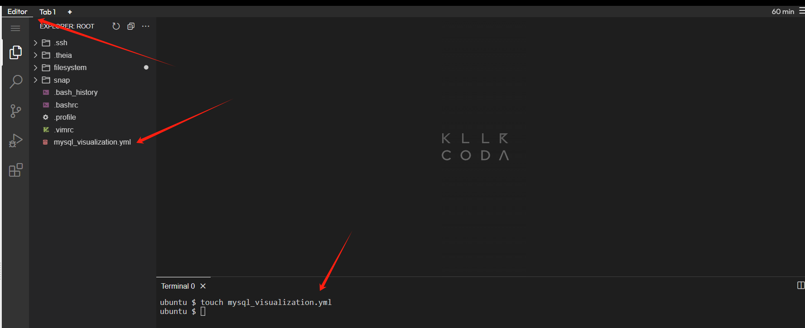

# Visualizing MySQL Databases

## Creating a YAML Configuration File

Create a .yml file to define the metrics to be displayed.

`touch mysql_visualization.yml`{{exec}}

## Barchart

Barcharts are used to show comparisons of multiple data items, usually in the form of bar charts for static or real-time data. In Sampler, the barcharts configuration can be used to display e.g. total number of records, maximum/minimum values, average values, etc.

Example


## Insert Test Data

First open mysql

`mysql`{{exec}}

`USE test_db; CREATE TABLE metrics ( id INT AUTO_INCREMENT PRIMARY KEY, value FLOAT NOT NULL, created_at TIMESTAMP DEFAULT CURRENT_TIMESTAMP); INSERT INTO metrics (value) VALUES (10.5), (14.8), (12.1), (9.4), (15.7);`{{exec}}


## Barcharts configuration: extracting data from test_db

We will use Sampler's barcharts to display some basic statistics from the database, such as the total number of records in the metrics table, the maximum, minimum, and average values.

Please put this part of the code in the yml file

You can find and modify your yml file by following the steps shown here




```
barcharts:
  - title: "Test Database Metrics Overview"
    rate-ms: 2000
    scale: 0
    items:
      - label: "Total Records"
        sample: "echo \"SELECT COUNT(*) FROM metrics;\" | mysql -u test_user -ppassword test_db -N"
      - label: "Max Value"
        sample: "echo \"SELECT MAX(value) FROM metrics;\" | mysql -u test_user -ppassword test_db -N"
      - label: "Min Value"
        sample: "echo \"SELECT MIN(value) FROM metrics;\" | mysql -u test_user -ppassword test_db -N"
      - label: "Average Value"
        sample: "echo \"SELECT AVG(value) FROM metrics;\" | mysql -u test_user -ppassword test_db -N"
```{{copy}}

### Detailed Explanation of Configuration Items

The configuration below can be modified in any way, and you can configure different combinations to suit your situation.

title: “Test Database Metrics Overview”.
This is the title of the chart, which indicates that it shows some basic statistics about the metrics table in the test_db database.

rate-ms: 2000.
The data is refreshed every 2000 milliseconds (2 seconds) to ensure that the data on the chart is up to date.

items.
This lists some of the metrics to be displayed. Each item represents a bar in the chart, and each bar performs a database query.

label: “Total Records”.
This bar displays the total number of records in the metrics table. The query command is SELECT COUNT(*).

label: “Max Value”.
This bar displays the maximum value of the value column in the metrics table. The query command is SELECT MAX(value).

label: “Min Value”.
This bar displays the minimum value of the value column in the metrics table. The query command is SELECT MIN(value).

label: “Average Value”: The bar displays the minimum value of the value column in the metrics table.
This bar displays the average value of the value column in the metrics table. The query command is SELECT AVG(value).

## Running the Sampler

Once you have configured barchart, you can run Sampler with the following command and load your configuration file:

`sampler -c mysql_visualization.yml`{{exec}}

In this way, Sampler will display the real-time data you define in the MySQL database according to the configuration, and the bars will automatically refresh the data according to the time interval defined by rate-ms.


